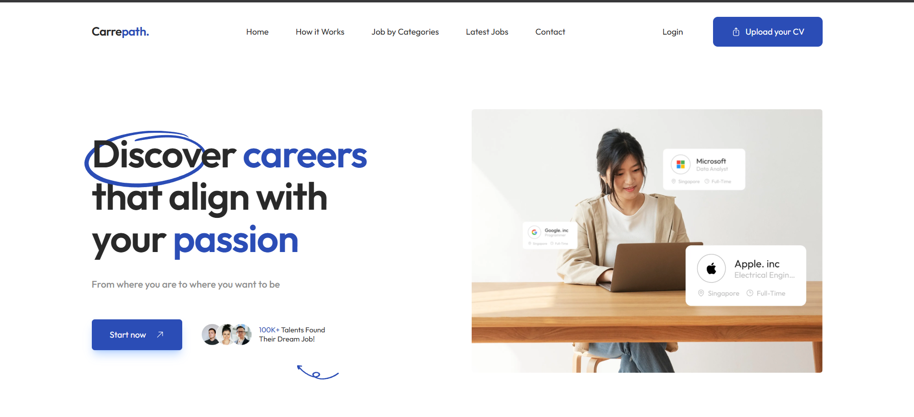

<div align="center">

  # Carrepath
  ### AI-Powered Career Platform for the Next Generation Workforce

  [](https://carrepath.azhel.my.id/)
  [](https://github.com/Aimannawal/carrepath-frontend)
  [](LICENSE)

  **Submission for ITECHNO CUP 2026 — Web Development**

  **By WHN YH Institut**

</div>

---

## 📋 Daftar Isi

- [Tentang Proyek](#-tentang-proyek)
- [Fitur Unggulan](#-fitur-unggulan)
- [Demo & Screenshot](#-demo--screenshot)
- [Teknologi](#-teknologi)
- [Arsitektur Sistem](#-arsitektur-sistem)
- [Instalasi & Setup](#-instalasi--setup)
- [Penggunaan](#-penggunaan)
- [API Documentation](#-api-documentation)
- [Testing](#-testing)
- [Tim Developer](#-tim-developer)
- [Lisensi](#-lisensi)

---

## 👥 Tim Developer

| Nama | Peran | GitHub |
|------|-------|--------|
| **Aiman Wafi'i An Nawal** | Project Lead & Fullstack Developer | [Aimannawal](https://github.com/Aimannawal) |
| **Muhammad Rizal Ramzi** | UI/UX Designer | [Rizalramzi](https://github.com/Rizalramzi) |

---

## 🎯 Tentang Proyek

### Latar Belakang

Berdasarkan data Kementerian Ketenagakerjaan, sekitar **70% pelamar kerja ditolak** dalam proses rekrutmen. Salah satu penyebab utamanya adalah CV yang tidak optimal. Banyak pencari kerja membuat CV secara generik, tidak relevan dengan posisi yang dilamar, dan gagal menonjolkan skill yang dibutuhkan industri. Di sisi lain, kemudahan melamar kerja secara online mendorong pelamar mengirim CV secara massal tanpa optimasi.

### Solusi yang Ditawarkan

Carrepath hadir sebagai platform karir berbasis AI yang membantu pencari kerja membangun CV yang tepat sasaran, memahami arah karir yang sesuai dengan profil mereka, dan menemukan peluang kerja serta bootcamp yang relevan — semuanya dalam satu platform.

### Tujuan Proyek

- 🎯 **Tujuan Utama**: Meningkatkan kualitas CV dan peluang kerja pencari kerja Indonesia melalui kecerdasan buatan
- 📊 **Target Pengguna**: Pencari kerja (worker), perusahaan (company), dan penyedia bootcamp (provider)
- 💡 **Value Proposition**: Satu-satunya platform yang menggabungkan AI CV builder, career direction analysis, dan job marketplace dalam satu ekosistem

---

## ✨ Fitur Unggulan

### Fitur Utama

| Fitur | Deskripsi | Keunggulan |
|-------|-----------|------------|
| **Auto-Generate CV** | Membuat CV profesional secara otomatis sesuai standar industri | Cocok untuk pengguna yang belum punya CV, output langsung siap pakai |
| **Optimize CV** | Upload CV lalu AI menganalisis dan menghasilkan study plan peningkatan skill | Rekomendasi berbasis gap analysis antara profil dan kebutuhan industri |
| **Career Direction** | Analisis kecocokan karir berbasis CV dalam bentuk persentase | Membantu pengguna menentukan arah karir dengan data, bukan tebakan |
| **Carrepath AI Chat** | Asisten AI yang memandu pengguna dalam perjalanan karir | Rekomendasi pekerjaan & bootcamp yang relevan secara personal |

### Fitur Tambahan

- **Job Marketplace** — Pencarian dan lamaran kerja dengan filter category, type, dan location
- **Bootcamp Discovery** — Temukan bootcamp dari berbagai provider dengan detail lengkap
- **Company Dashboard** — CRUD job listing, review applicant, dan rekomendasi bootcamp ke calon karyawan
- **Provider Dashboard** — Kelola bootcamp dan profil provider
- **Save Jobs & Companies** — Simpan lowongan dan perusahaan favorit
- **Premium System** — Upgrade ke premium untuk company/provider dengan fitur featured job
- **Admin Dashboard** — Monitoring revenue, statistik pengguna, dan manajemen transaksi
- **File Upload** — Upload foto profil dan CV PDF langsung ke storage

---

## 📸 Demo & Screenshot

### Live Demo

🔗 **[Kunjungi Website — carrepath.azhel.my.id](https://carrepath.azhel.my.id/)**

### Video Demo

📹 **[Tonton Video Demo](https://drive.google.com/file/d/1qroTMm8Whle4ANhdtSlvcM3wsilRQOB9/view?usp=sharing)**

### Screenshot Aplikasi

<div align="center">
  
  <p><em>Carrepath — AI-Powered Career Platform</em></p>
</div>

---

## 🛠️ Teknologi

### Tech Stack

#### Frontend
```
Framework    : Nuxt.js 4 (Vue 3)
UI Library   : Tailwind CSS v4
HTTP Client  : $fetch / useFetch (Nuxt built-in)
Charts       : Chart.js + vue-chartjs
Animation    : GSAP
PDF          : html2pdf.js, jspdf, pdfjs-dist
Icons        : @nuxt/icon
Fonts        : Google Fonts (Outfit) via @nuxtjs/google-fonts
Image Opt    : @nuxt/image + IPX
Compression  : vite-plugin-compression (gzip + brotli)
```

#### Backend
```
Language     : Go 1.26
Framework    : Gin
Database     : PostgreSQL (via Supabase)
Auth         : Supabase Auth (Email + Google OAuth)
Storage      : Supabase Storage
AI           : Google Gemini API (2.5 Flash Lite)
```

#### DevOps & Tools
```
Frontend     : Deployed via custom server (SSR)
Backend      : Railway
Database     : Supabase (PostgreSQL)
Storage      : Supabase Storage
Design       : Figma
```

### Alasan Pemilihan Teknologi

| Teknologi | Alasan Pemilihan |
|-----------|-----------------|
| **Nuxt.js 4** | SSR out-of-the-box meningkatkan SEO secara signifikan — penting untuk halaman job listing agar terindeks search engine. Performance-nya juga lebih baik karena halaman di-render di server sebelum dikirim ke client |
| **Tailwind CSS v4** | Utility-first approach mempercepat development UI dan hasilnya konsisten. v4 lebih ringan dengan compiler baru berbasis Vite |
| **Go + Gin** | Performa tinggi dengan memory footprint yang sangat kecil. Cocok untuk API yang harus menangani banyak concurrent request. Compile ke single binary sehingga deployment di Railway jauh lebih simpel |
| **Supabase** | Menggabungkan PostgreSQL, Auth, Storage, dan Realtime dalam satu platform. Mengurangi kompleksitas infrastruktur secara drastis |
| **Google Gemini** | Model multimodal yang mendukung OCR untuk membaca PDF CV, kemudian menganalisis isinya untuk generate rekomendasi yang kontekstual |

### Dependencies Utama

```json
{
  "dependencies": {
    "nuxt": "^4.4.2",
    "vue": "^3.5.31",
    "chart.js": "^4.4.1",
    "gsap": "^3.14.2",
    "html2pdf.js": "^0.14.0",
    "jspdf": "^4.2.1",
    "@nuxt/icon": "^2.2.1",
    "@nuxt/image": "^2.0.0",
    "@nuxtjs/google-fonts": "^3.2.0"
  },
  "devDependencies": {
    "tailwindcss": "^4.2.2",
    "@tailwindcss/vite": "^4.2.2",
    "vite-plugin-compression": "^0.5.1"
  }
}
```

---

## 🏗️ Arsitektur Sistem

### System Architecture

```
┌─────────────────────────────────────────────────────────┐
│                      CLIENT                             │
│              Browser / Mobile Browser                   │
└─────────────────────┬───────────────────────────────────┘
                      │  HTTPS
┌─────────────────────▼───────────────────────────────────┐
│               FRONTEND (Nuxt.js SSR)                    │
│         carrepath.azhel.my.id                           │
│  ┌─────────────┐  ┌──────────────┐  ┌────────────────┐  │
│  │   Pages     │  │  Components  │  │   Composables  │  │
│  │  /jobs      │  │  JobCard     │  │   useAuth      │  │
│  │  /cv        │  │  CVEditor    │  │   useProfile   │  │
│  │  /dashboard │  │  AIChat      │  │   useJobs      │  │
│  └─────────────┘  └──────────────┘  └────────────────┘  │
└─────────────────────┬───────────────────────────────────┘
                      │  REST API (HTTPS)
┌─────────────────────▼───────────────────────────────────┐
│              BACKEND (Go + Gin) — Railway                │
│  ┌──────────┐  ┌──────────┐  ┌────────────────────────┐  │
│  │  /auth   │  │  /jobs   │  │  /ai                   │  │
│  │  /users  │  │  /apply  │  │  generate, optimize,   │  │
│  │  /worker │  │  /saved  │  │  study-plan, chat      │  │
│  └──────────┘  └──────────┘  └────────────────────────┘  │
└──────────┬───────────────────────────┬────────────────────┘
           │                           │
┌──────────▼──────────┐   ┌────────────▼───────────────────┐
│  Supabase           │   │  Google Gemini API             │
│  ┌───────────────┐  │   │  - OCR CV (PDF)                │
│  │  PostgreSQL   │  │   │  - Generate Resume             │
│  │  Auth         │  │   │  - Study Plan                  │
│  │  Storage      │  │   │  - Career Direction            │
│  └───────────────┘  │   │  - AI Chat                     │
└─────────────────────┘   └────────────────────────────────┘
```

### Folder Structure (Frontend)

```
fe/
├── assets/             # CSS global (main.css, styles.css, fonts.css)
├── components/         # Reusable Vue components
├── composables/        # Shared logic (useAuth, useProfile, dll)
├── layouts/            # Layout templates (default, dashboard, auth)
├── pages/              # File-based routing (Nuxt)
│   ├── index.vue       # Landing page
│   ├── jobs/           # Job listing & detail
│   ├── cv/             # CV generator & optimizer
│   ├── dashboard/      # Dashboard worker, company, provider
│   └── auth/           # Login, register, callback
├── public/             # Static assets (logo, favicon)
├── nuxt.config.ts      # Konfigurasi Nuxt
└── package.json
```

---

## ⚙️ Instalasi & Setup

### Prerequisites

- **Node.js** v18.x atau lebih tinggi
- **npm** / **yarn** / **pnpm**
- **Git**

### Langkah Instalasi — Frontend

#### 1️⃣ Clone Repository

```bash
git clone https://github.com/Aimannawal/carrepath-frontend.git
cd carrepath-frontend
```

#### 2️⃣ Install Dependencies

```bash
npm install
```

#### 3️⃣ Setup Environment Variables

Buat file `.env` di root directory berdasarkan `.env.example`:

```bash
cp .env.example .env
```

Lalu isi nilai yang diperlukan:

```env
NUXT_PUBLIC_API_URL=http://localhost:8080
NUXT_PUBLIC_SITE_URL=http://localhost:3000
```

#### 4️⃣ Jalankan Development Server

```bash
npm run dev
```

Aplikasi berjalan di `http://localhost:3000`

---

### Setup — Backend (Go + Gin)

#### Prerequisites Backend

- **Go** 1.21+
- Akun **Supabase** dengan project yang sudah dikonfigurasi

#### 1️⃣ Clone Repository Backend

> Repository backend bersifat private.

#### 2️⃣ Install Dependencies

```bash
go mod download
```

#### 3️⃣ Setup Environment Variables

Buat file `.env` berdasarkan `.env.example`:

```env
SUPABASE_URL=https://your-project.supabase.co
SUPABASE_KEY=your-supabase-anon-key
FRONTEND_URL=http://localhost:3000
PORT=8080
```

#### 4️⃣ Run Backend Server

```bash
go run main.go
```

Server berjalan di `http://localhost:8080`

---

## 🚀 Penggunaan

### Menjalankan Aplikasi

```bash
# Development mode
npm run dev

# Production build
npm run build
npm run preview

# Static generation
npm run generate
```

### User Guide

#### Untuk Worker (Pencari Kerja)

1. **Registrasi/Login** — Daftar via email atau Google OAuth
2. **Set Role** — Pilih role sebagai "worker"
3. **Lengkapi Profil** — Isi data diri, pengalaman kerja, dan skill
4. **Auto-Generate CV** — Buat CV profesional otomatis dari data profil
5. **Optimize CV** — Upload CV yang ada, dapatkan analisis dan study plan
6. **Career Direction** — Lihat kecocokan karir dalam persentase
7. **Cari Kerja** — Browse job listing, filter sesuai kebutuhan, lalu apply
8. **Carrepath AI** — Tanya asisten AI untuk rekomendasi karir personal

#### Untuk Company (Perusahaan)

1. **Registrasi & Set Role** — Pilih role "company"
2. **Lengkapi Profil Perusahaan** — Isi detail perusahaan dan logo
3. **Buat Job Listing** — Post lowongan kerja dengan detail lengkap
4. **Review Applicant** — Lihat dan kelola lamaran masuk
5. **Rekomendasikan Bootcamp** — Sarankan bootcamp ke calon karyawan
6. **Upgrade Premium** — Aktifkan featured job untuk visibilitas lebih tinggi

#### Untuk Provider (Penyedia Bootcamp)

1. **Registrasi & Set Role** — Pilih role "provider"
2. **Kelola Bootcamp** — Tambah, edit, dan hapus program bootcamp
3. **Upgrade Premium** — Boost visibilitas bootcamp di platform

#### Untuk Super Admin

1. **Akses Admin Dashboard** — Login dengan akun super admin, lalu navigasi ke `/admin`
2. **Monitor Revenue** — Lihat total pendapatan platform dari seluruh transaksi premium
3. **Revenue Trend** — Pantau grafik tren pendapatan dari waktu ke waktu
4. **Kelola Transaksi** — Review semua transaksi yang masuk (pending, success, failed)
5. **Premium Users** — Lihat daftar worker, company, dan provider yang aktif berlangganan premium
6. **Platform Stats** — Pantau statistik keseluruhan platform (total user, job, bootcamp, dll)

---

## 📚 API Documentation

### Base URL

```
Development : http://localhost:8080
Production  : [Private — contact team]
```

> ⚠️ URL backend production bersifat private dan tidak dipublikasikan.

---

### 🔐 Authentication

#### Sign Up
```http
POST /auth/signup
```
**Body:**
```json
{
  "email": "user@example.com",
  "password": "yourpassword",
  "full_name": "Nama Lengkap"
}
```
**Response:**
```json
{
  "message": "Sign up and auto-login successful",
  "token": "eyJ...",
  "user": { ... }
}
```

#### Login
```http
POST /auth/login
```
**Body:**
```json
{
  "email": "user@example.com",
  "password": "yourpassword"
}
```
**Response:**
```json
{
  "message": "Login successful",
  "token": "eyJ...",
  "user": { ... }
}
```

#### Google OAuth
```http
GET /auth/google
```
Redirect ke Google OAuth flow via Supabase.

---

### 👤 Users

#### Set Role
```http
POST /users/set-role
```
**Body:**
```json
{
  "user_id": "uuid",
  "role": "worker" 
}
```
> `role` dapat berisi: `worker`, `company`, `provider`

#### Get Profile
```http
GET /users/profile/:id
```

---

### 👷 Workers

#### Get Worker Profile
```http
GET /workers/profile/:user_id
```
**Response:** Profile + experiences + skills + user data

#### Update Worker Profile
```http
PUT /workers/profile/:user_id
```
**Body (partial update):**
```json
{
  "phone": "08123456789",
  "bio": "Full stack developer...",
  "field_of_work": "Software Engineering",
  "address": "Surabaya",
  "province": "Jawa Timur",
  "city": "Surabaya",
  "country": "Indonesia",
  "website": "https://portfolio.dev"
}
```

#### Add Experience
```http
POST /workers/experience
```
**Body:**
```json
{
  "worker_id": "uuid",
  "company_name": "PT Example",
  "role": "Frontend Developer",
  "start_date": "2023-01",
  "end_date": "2024-06",
  "tasks": "Developed UI components..."
}
```

#### Update Experience
```http
PUT /workers/experience/:id
```

#### Delete Experience
```http
DELETE /workers/experience/:id
```

#### Add Skill
```http
POST /workers/skill
```
**Body:**
```json
{
  "worker_id": "uuid",
  "skill_name": "Vue.js"
}
```

#### Delete Skill
```http
DELETE /workers/skill/:id
```

---

### 🏢 Companies

#### Get Company Profile
```http
GET /companies/profile/:user_id
```

#### Update Company Profile
```http
PUT /companies/profile/:user_id
```
**Body (partial update):**
```json
{
  "company_name": "PT Contoh Indonesia",
  "company_email": "hr@contoh.co.id",
  "phone": "031-1234567",
  "category": "Technology",
  "owner_name": "Budi Santoso",
  "description": "Perusahaan teknologi...",
  "address": "Surabaya, Jawa Timur"
}
```

#### List All Companies
```http
GET /companies/list?category=Technology
```

#### Get Company Jobs
```http
GET /companies/:company_id/jobs
```

#### Get Recommended Bootcamps
```http
GET /companies/:company_id/recommended-bootcamps
```

#### Add Recommended Bootcamp
```http
POST /companies/recommended-bootcamp
```
**Body:**
```json
{
  "company_id": "uuid",
  "bootcamp_id": "uuid"
}
```

#### Delete Recommended Bootcamp
```http
DELETE /companies/recommended-bootcamp/:id
```

---

### 🎓 Providers & Bootcamps

#### Get Provider Profile
```http
GET /providers/profile/:user_id
```

#### Update Provider Profile
```http
PUT /providers/profile/:user_id
```

#### Get Provider Bootcamps
```http
GET /providers/:provider_id/bootcamps
```

#### List All Bootcamps
```http
GET /bootcamps
```

#### Get Bootcamp Detail
```http
GET /bootcamps/:id
```

#### Create Bootcamp
```http
POST /bootcamps
```
**Body:**
```json
{
  "provider_id": "uuid",
  "title": "Full Stack Web Development",
  "description": "Bootcamp intensif...",
  "category": "Web Development",
  "level": "Beginner",
  "price": 2500000,
  "link_url": "https://bootcamp.example.com",
  "image_url": "https://...",
  "is_active": true
}
```

#### Update Bootcamp
```http
PUT /bootcamps/:id
```

#### Delete Bootcamp
```http
DELETE /bootcamps/:id
```

---

### 💼 Jobs

#### List Jobs
```http
GET /jobs?category=Technology&type=full-time&location_type=remote
```
> **Query params:** `category` (string), `type` (`full-time` | `part-time` | `internship` | `freelance`), `location_type` (`onsite` | `remote` | `hybrid`)

**Response:**
```json
{
  "data": [ ... ],
  "message": "List jobs success"
}
```
> Featured jobs selalu muncul di urutan teratas.

#### Get Job Detail
```http
GET /jobs/:id
```

#### Create Job
```http
POST /jobs
```
**Body:**
```json
{
  "company_id": "uuid",
  "title": "Backend Developer",
  "description": "Kami mencari...",
  "category": "Technology",
  "type": "full-time",
  "location_type": "remote",
  "salary_min": 8000000,
  "salary_max": 15000000,
  "status": "open",
  "is_featured": false,
  "expires_at": "2026-12-31"
}
```

#### Update Job
```http
PUT /jobs/:id
```
Semua field bersifat opsional (partial update).

#### Delete Job
```http
DELETE /jobs/:id
```

---

### 📝 Applications

#### Create Application
```http
POST /applications
```
**Body:**
```json
{
  "job_id": "uuid",
  "worker_id": "uuid",
  "cv_url": "https://storage.../cv.pdf",
  "cover_letter": "Dengan hormat..."
}
```

#### Get Worker Applications
```http
GET /applications/worker/:worker_id
```
**Response:** List lamaran beserta detail job dan company.

#### Get Job Applications
```http
GET /applications/job/:job_id
```
**Response:** List pelamar beserta profil worker.

#### Update Application Status
```http
PUT /applications/:id/status
```
**Body:**
```json
{
  "status": "accepted"
}
```
> `status` dapat berisi: `pending`, `accepted`, `rejected`

---

### 🤖 AI Features

#### Carrepath AI Chat
```http
POST /ai/chat
```
**Body:**
```json
{
  "worker_id": "uuid",
  "message": "Karir apa yang cocok untuk saya?"
}
```

#### Get Chat History
```http
GET /ai/chat-history/:worker_id
```

#### OCR Extract CV (dari PDF)
```http
POST /ai/ocr-extract
```
**Body:** `multipart/form-data` dengan field `file` (PDF)

#### Generate Resume (Auto-Generate CV)
```http
POST /ai/generate-resume
```
**Body:**
```json
{
  "worker_id": "uuid"
}
```

#### Optimize Resume
```http
POST /ai/optimize-resume
```
**Body:**
```json
{
  "worker_id": "uuid",
  "cv_text": "Isi teks CV yang diupload..."
}
```

#### Generate Study Plan
```http
POST /ai/study-plan
```
**Body:**
```json
{
  "worker_id": "uuid",
  "target_role": "Backend Engineer"
}
```

#### Get Resumes
```http
GET /ai/resumes/:worker_id
```

#### Update Resume
```http
PUT /ai/resumes/:id
```

#### Delete Resume
```http
DELETE /ai/resumes/:id
```

#### Save Resume Draft
```http
POST /ai/resume-draft
```

#### Get Resume Draft
```http
GET /ai/resume-draft/:worker_id
```

#### Get Study Plans
```http
GET /ai/study-plans/:worker_id
```

#### Get AI Quota
```http
GET /ai/quota/:worker_id
```
**Response:**
```json
{
  "data": {
    "ai_generate_used": 3,
    "ai_generate_quota": 10
  }
}
```

---

### 🔖 Saved

#### Save Company
```http
POST /saved/company
```
**Body:**
```json
{
  "worker_id": "uuid",
  "company_id": "uuid"
}
```

#### Unsave Company
```http
DELETE /saved/company/:id
```

#### Get Saved Companies
```http
GET /saved/companies/:worker_id
```

#### Get Saved Jobs
```http
GET /saved/jobs/:worker_id
```

#### Save Bootcamp
```http
POST /saved/bootcamp
```
**Body:**
```json
{
  "worker_id": "uuid",
  "bootcamp_id": "uuid"
}
```

#### Unsave Bootcamp
```http
DELETE /saved/bootcamp/:id
```

#### Get Saved Bootcamps
```http
GET /saved/bootcamps/:worker_id
```

---

### 💳 Payment

#### List Packages
```http
GET /payment/packages?target_role=worker
```
> `target_role`: `worker`, `company`, `provider`

#### Create Transaction
```http
POST /payment/transaction
```
**Body:**
```json
{
  "user_id": "uuid",
  "package_id": "uuid",
  "payment_method": "transfer"
}
```
> `payment_method`: `transfer`, `qris`, `va`

#### Confirm Transaction
```http
PUT /payment/transaction/:id/confirm
```
Mengonfirmasi pembayaran dan langsung mengaplikasikan benefit (tambah quota AI atau aktifkan premium).

#### Get User Transactions
```http
GET /payment/transactions/:user_id
```

#### Get Transaction Detail
```http
GET /payment/transaction/:id
```

---

### 📁 Storage

#### Upload CV (PDF)
```http
POST /storage/upload/pdf/:worker_id
```
**Body:** `multipart/form-data` dengan field `file` (PDF)

#### Upload Profile Image
```http
POST /storage/upload/profile/:user_id
```
**Body:** `multipart/form-data` dengan field `file` (JPEG/PNG)

---

### 🛡️ Admin

#### Get Revenue Stats
```http
GET /admin/revenue
```

#### Get Platform Stats
```http
GET /admin/stats
```

#### Get All Transactions
```http
GET /admin/transactions
```

#### Get Premium Companies
```http
GET /admin/premium-companies
```

#### Get Premium Providers
```http
GET /admin/premium-providers
```

#### Get Premium Users
```http
GET /admin/premium-users
```

#### Get Revenue Trend
```http
GET /admin/revenue-trend
```

---

### Response Format

Semua endpoint menggunakan format response yang konsisten:

```json
// Success
{
  "data": { ... },
  "message": "Operation success"
}

// Error
{
  "error": "Pesan error yang deskriptif"
}
```

---

## 🧪 Testing

### Manual Testing

Gunakan tools berikut untuk test API secara manual:

```bash
# Health check
curl http://localhost:8080/

# Test login
curl -X POST http://localhost:8080/auth/login \
  -H "Content-Type: application/json" \
  -d '{"email":"test@example.com","password":"password123"}'

# List jobs
curl http://localhost:8080/jobs

# List jobs dengan filter
curl "http://localhost:8080/jobs?type=full-time&location_type=remote"
```

### Recommended Tools

- **[Postman](https://www.postman.com/)** — Import semua endpoint dan buat collection untuk testing
- **[Thunder Client](https://www.thunderclient.com/)** — Extension VS Code untuk REST API testing
- **[Hoppscotch](https://hoppscotch.io/)** — Alternatif Postman berbasis web

### Frontend

```bash
# Jalankan dev server
npm run dev

# Build dan preview production
npm run build
npm run preview
```

---

## 📄 Lisensi

Proyek ini dilisensikan di bawah [MIT License](LICENSE) — lihat file LICENSE untuk detail lebih lanjut.

---

<div align="center">

  **Made with ❤️ by WHN YH Institut for ITECHNO CUP 2026**

</div>
